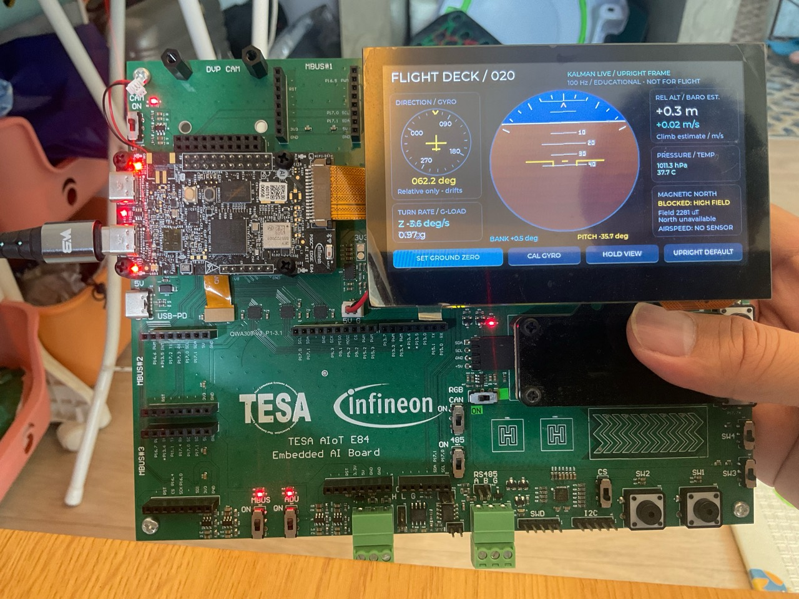

# Chapter 020 — Kalman flight-style dashboard

A touchscreen attitude dashboard on the TESA AIoT E84 / Waveshare 4.3-inch
800×480 display, running on CM55. It reuses the Chapter 017 display/startup
pipeline and Chapter 018 FT5406 touch driver.



*User-provided hardware photo, 2026-10-11: the current flight deck running on
the board, including the rotating degree card, attitude indicator and barometer.
The high-field warning correctly keeps magnetic north unavailable.*

## Dashboard

- Central artificial horizon with rotating sky/ground, pitch ladder, bank
  scale, and a fixed yellow aircraft reference.
- Bank/pitch numbers, a circular relative-heading dial, body-Z turn rate and
  acceleration magnitude (G-load). The numbered dial is **not magnetic north**.
  Its yellow top marker and central aircraft stay fixed while the degree card
  rotates underneath. The 000/090/180/270 labels move with their ticks but stay
  upright (not rotated or upside down); the numeric readout remains stationary.
  A right turn moves the card counterclockwise, bringing the new heading to the top.
- DPS368 relative barometric altitude, estimated climb/descent rate, pressure
  and sensor temperature. No made-up airspeed or GPS readings.
- Live fusion frequency, calibration/stale-data indicators and magnetic warnings.
- **SET GROUND ZERO:** hold still, then use the current pose as the level frame,
  restart relative gyro heading at zero and use the latest fresh pressure as
  the zero-altitude reference. Clears HOLD. Unavailable/stale IMU data or ongoing
  gyro calibration rejects the action; unavailable barometer leaves its old
  reference unchanged. This is a local reference, not terrain height or QNH.
- **CAL GYRO:** hold still for one second to estimate the three gyro offsets.
- **HOLD VIEW / RESUME:** freeze the horizon and numbers while fusion continues.
- **UPRIGHT DEFAULT:** restore the normal landscape/top-edge-up mounting and
  restart attitude/relative heading. Does not change the pressure reference.

The normal level pose is **upright, display facing you, top edge upward**.
It should show half sky and half ground. Lying screen-up is approximately
-90 degrees pilot pitch in this mounting, not level. SET GROUND ZERO can deliberately
choose another resting pose. References are RAM-only and reset on reboot.

Pilot-facing convention (`pilot_v2`, corrected after the user's motion videos):

- Tilt the panel's top edge toward you: positive pitch / nose up / more sky.
- Tilt its top edge away: negative pitch / nose down / more ground.
- Turn right about vertical: heading increases (a quarter turn from zero is 090°).
- Turn left: heading decreases and wraps (a quarter turn from zero is 270°).
- Bank sign is unchanged. Heading is displayed as 000.0–359.9°, never negative;
  rounding is included in wrapping so 359.96° displays 000.0°, not 360.0°.

The board has a **BMI270 accelerometer/gyro and BMM350 magnetometer**, confirmed
by the [Infineon kit guide](https://www.infineon.com/assets/row/public/documents/30/44/infineon-kit-pse84-ai-qsg-usermanual-en.pdf).
This application now reads the BMM350 through a chapter-local **native I3C
PDL backend**, without changing the global Zephyr tree or soldering resistors.
The upstream Zephyr Infineon controller/device-tree integration remains a
separate task; this backend is not a generic Zephyr I3C controller driver.

The magnetic card shows live, factory-compensated X/Y/Z in µT. `HIGH FIELD`
warns when magnitude exceeds this application's 100 µT threshold. Bus health
and heading quality are deliberately separate: **yaw remains gyro-integrated**,
relative to startup or ground zero, and can drift. Magnetic mounting alignment,
hard/soft-iron calibration and tilt-compensated heading are not implemented.
Do not interpret the `compass=live` serial flag as validated north accuracy.

### What our sensors can and cannot provide

| Instrument | Sensor / meaning | Limitation |
| --- | --- | --- |
| Artificial horizon / bank / pitch | BMI270 accel + gyro, Kalman filtering | Linear acceleration and extreme attitudes affect accuracy |
| Directional dial / turn rate | Integrated gyro / body-Z angular rate | Relative and drifting; not north or a certified turn coordinator |
| G-load | Magnitude of accelerometer specific force | Not a signed aircraft normal-load factor |
| Relative altitude / climb | DPS368 pressure, filtered standard-atmosphere estimate | Weather, airflow and temperature drift; not altitude above terrain |
| Magnetic north | BMM350 data available | **Disabled** until field environment, calibration and mounting are validated |
| Airspeed / ground speed | No suitable input in this application | Requires air-data sensing / GNSS respectively |

The board DTS exposes `pressure-sensor = &dps368` on SCB0 at 0x77. Zephyr's
DPS310-compatible driver returns pressure in **kPa**; the UI converts it to hPa.
The [DPS368 datasheet](https://www.infineon.com/dgdl/Infineon-DPS368-DataSheet-v01_01-EN.pdf?fileId=5546d46269e1c019016a0c45105d4b40)
describes pressure and temperature measurement. Sensor temperature is not
necessarily ambient cabin temperature on a warm board.

A separate worker requests temperature-compensated samples at 10 Hz. Driver
conversion waits do not block the IMU task; the SCB0 driver serializes shared
I2C transfers. First valid pressure sets the boot reference. Height is estimated
as `44330 * (1 - (pressure / reference)^0.19029496)` metres, with 0.5 s height
and 1.5 s derivative low-pass time constants. Climb is a noisy, lagged estimate,
not an IMU/GNSS vertical-navigation solution. Pressure outside 30–120 kPa is
rejected. Data older than 500 ms is blanked; gaps over 2 seconds reset the
derivative without losing the ground pressure. Weather changes can still
produce apparent height/climb while stationary.

## BMM350 I3C backend

- Default board wiring: P3.0=SCL, P3.1=SDA, both 1.8 V, through R222/R221.
  R220/R223 are the alternate I2C route and are not changed. MAG_INT=P6.4
  is not required here: the data-ready status register is polled; IBI is unused.
- Existing secure boot companion supplies the board clocks. The local backend
  enables I3C's MMIO clock and dedicated peripheral divider, verifies 100 MHz,
  sets the pin mux and 1.8 kΩ internal pull-ups, then initializes the controller.
- Manual timings give nominal 10 MHz push-pull and 200 ns open-drain high
  (BMM350 requires at least 160 ns). Timing is configured, not scope-measured.
- Broadcast RSTDAA followed by SETDASA assigns a dynamic address from static
  address 0x15; hardware returned dynamic address 0x09 and chip ID 0x33.
- To handle warm MCU resets, explicitly soft-reset the sensor, reinitialize
  the controller and repeat RSTDAA/SETDASA before loading OTP. Without this,
  a sensor left running by the previous firmware can have OTP powered off.
- Bosch SensorAPI loads factory OTP compensation, performs its magnetic reset,
  enables XYZ and starts 25 Hz / averaging 8 acquisition. The init soft-reset
  inside the Bosch API is skipped because addressing was restored after the
  explicit reset above; see the
  [Infineon integration notes](https://github.com/Infineon/sensor-orientation-bmm350).
- The dedicated lower-priority worker owns the bus. Private transfers have a
  20 ms wait bound, and sensor initialization/read callbacks have operation
  deadlines. Only the short polled transfer temporarily runs at priority 3
  (below IMU priority 2, above UI priority 5); long init/CCC paths remain at 6.
  This prevents a full display refresh from consuming the poll deadline before
  FIFO/completion service. Completion is checked after preemption before
  deciding a transfer timed out. Blocking PDL setup paths retain their own finite timeout. The
  worker does not hold the telemetry mutex during bus operations. A transport
  error marks the sensor unavailable until board reset; the IMU/UI continue.
- Repeat programming exposed an independent stuck **SCB0 I2C** bus, with
  BMI270, DPS368 and SHT4X all timing out before I3C started. A chapter-local
  boot hook now checks P8.0/P8.1 before the I2C driver initializes. Only when
  stuck, it emits up to nine open-drain clock pulses and STOP, with bounded
  clock-stretch waits, then restores pin state. It does not touch I3C or
  display/touch pins. Hardware confirmed `stuck=1 pulses=9 clear=1` followed
  by successful IMU and magnetometer initialization. Driver error logs remain
  enabled to expose future startup failures.
- Logs distinguish controller stages, sensor init, live data and stale/error
  state. An initialization ACK alone is not treated as live magnetic data.

Vendored Bosch code/version and local change are recorded in
[`vendor/bmm350/README.md`](vendor/bmm350/README.md).

## Filter and timing

The sensor thread runs at 100 Hz with higher priority than LVGL. Each axis uses
a two-state Kalman filter (`angle`, `gyro bias`), with gyro prediction and
accelerometer angle correction. Full Euler rate coupling is included; angles
and innovations wrap across ±180°. Accelerometer corrections are gated when
the measured magnitude is outside 0.85–1.15 g. This rejects many motion
disturbances, but is not full inertial navigation or a quaternion EKF.

Inputs use g, rad/s, and measured elapsed seconds. Outputs use degrees.
Native BMI270 **vectors** are rotated before filtering: filter X = -native Z,
filter Y = native X, filter Z = -native Y. This determinant +1 rotation is applied
to both acceleration and bias-corrected gyro. Upright resting native gravity
is approximately (0,-1,0), which becomes filter (0,0,+1). No 90-degree display
subtraction or post-filter Euler-axis swapping is used. The filter's internal
sign convention is distinct from the pilot-facing output convention:
`bank = filter roll`, `pitch = -filter pitch`, `yaw = -filter yaw`.
This is conjugation of the attitude rotation by `diag(1,-1,-1)` (both body and
world bases), not an improper reflection of sensor vectors. Displayed body
rates transform by the same diagonal matrix. Telemetry, numbers, heading
needle and horizon all consume the converted pilot values; the estimator
continues using the original, mutually consistent accelerometer/gyro inputs.

Ground zero composes `Ry(filter pitch) * Rx(filter roll)` with the existing frame and resets
the estimator. This rotates the estimated resting gravity to +Z while keeping
gyro/acceleration axes consistent, including after repeated zero operations.
It must use **internal estimator angles**, not the sign-converted telemetry.
The Euler rate conversion is limited near ±80° body pitch to avoid its
vertical singularity. Extreme/inverted motion is not a validated operating
range. This example is an educational motion display, not a flight instrument.

At startup, calibration requires 100 consecutive readings within 0.97–1.03 g
and below 5 deg/s gyro magnitude. Moving the board restarts that window.
Calibration is also available by touch or serial. Hold the board still when
requested: a constant slow rotation can be mistaken for gyro bias. Calibration
reinitializes the filter and relative yaw but retains the selected ground frame.

The horizon is rendered into a 344×344 RGB565 image in graphics SRAM, with a
precomputed color palette. All LVGL calls run on the main thread. Sensor data
crosses to the UI through short mutex-protected snapshots. Data older than
150 ms is marked stale rather than presented as a current attitude.

## Build, program, and test

```bash
./build.sh
./flash.sh
python3 test_attitude.py
python3 test_flight_math.py
python3 test_bus_recovery.py
/home/wasanw/zephyrproject/.venv/bin/python test_firmware.py
/home/wasanw/zephyrproject/.venv/bin/python test_firmware.py --case baro
/home/wasanw/zephyrproject/.venv/bin/python test_compass.py --case id
/home/wasanw/zephyrproject/.venv/bin/python test_compass.py --case data --seconds 30
# Separate magnetic-environment check; intentionally fails under HIGH FIELD:
/home/wasanw/zephyrproject/.venv/bin/python test_compass.py --case field
```

`test_attitude.py` compiles the actual C estimator/renderer on the host. It
checks static level, gyro bias convergence, combined rotations, disturbance
gating, invalid values/timing, yaw integration, angle wrap, and raster memory
guards. With Pillow installed it saves a three-pose render under `test-results/`.
`test_flight_math.py` compiles the actual frame/barometer code. It checks
upright and flat poses, signed bank/pitch, gyro axes, repeated ground-zero
rotation orthogonality, restoring default mounting, known height/climb inputs,
pressure reference reset, missing-data recovery and invalid input rejection.
Direction tests also use explicit native input trajectories anchored to the
motion videos: nose-up/down pitch with matching gyro, clockwise/right and
counterclockwise/left yaw, unchanged bank, zero after positive/negative pitch,
heading wrap boundaries, and the rendered sky area for positive/negative pitch.
These supplement inverse-transform consistency tests; they are not a substitute
for physically moving the board and confirming its response.
`test_bus_recovery.py` compiles the actual bus-clear routine against a GPIO
model: idle bus, release after nine clocks, persistent SDA-low, persistent
SCL-low, bounded wait and pin-state restoration. The model supplements the
physical stuck-bus recovery above; it is not an electrical timing measurement.

`test_firmware.py` tests the physical board: live sample/render counters,
fusion frequency, display scanout, touch readiness, stationary calibration,
ground pose/pressure reference, 10 Hz barometer data, hold/resume and restoring
upright mounting. It records a timestamped serial log.
Independent cases: `--case health`, `--case calibrate`, `--case zero`, and
`--case hold`, `--case baro`, and `--case upright`. Keep the board still for the
automated calibration/zero test. The full test ends in UPRIGHT DEFAULT.
Actual upright appearance, bank/pitch directions and touchscreen taps require
physical observation; serial success alone does not prove them.

`test_compass.py --case all` checks chip ID, dynamic address, clock, fresh
compensated XYZ/temperature, sample rate, transfer progression and no new
bus errors. It warns but does not fail transport tests for high field. The
independent `--case field` checks the 100 µT warning threshold; it does not
validate north accuracy. Logs are saved under `test-results/`.

Serial commands all use a caller-chosen token:

```text
horizon info TOKEN
horizon zero TOKEN
horizon upright TOKEN
horizon calibrate TOKEN
horizon hold TOKEN
horizon live TOKEN
horizon compass TOKEN
```

Status reports `samples`, `corrections`, `rejected`, `renders`, angles scaled
by ten, G-force scaled by 100, calibration count, hold state, sample age,
touch readiness, the horizon raster CRC, and display/sensor errors.
It also includes frame selection, zero count, barometer samples/errors/age,
pressure/reference in Pa, temperature in hundredths of °C, relative altitude
in centimetres and climb in centimetres/second. `horizon zero` invokes the
same ground-reference handler as the touch button. `upright` restores mounting.
`convention=pilot_v2` identifies the corrected signs. `yaw10` is signed pilot
yaw; `heading10` is the rounded unsigned dial value (0–3599). `turn10` is pilot
body-Z rate in tenths of deg/s. Hardware tests reject the previous convention.
`heading_style=rotating_card` identifies the fixed-marker presentation.
`card_heading10` is the last rendered heading and freezes during HOLD VIEW,
while `heading10` continues to report the live sensor-derived heading.
The compass command adds chip ID, dynamic address, magnetic samples/errors,
transfer count, field warning, sample age, XYZ/temperature scaled by 100,
controller clock and last transfer status.

## Verification

### Fixed marker / readable rotating card — 2026-10-11

Replaced the moving needle with a stationary yellow top marker and aircraft
symbol. Degree ticks and label positions counter-rotate with heading, but label
glyphs remain upright. The host test sweeps all 360 whole-degree headings,
checks that the selected heading stays at the top, verifies wrap continuity,
and checks the upright label rectangles for clipping and mutual overlap.

Built and flashed both domains. Kalman/raster, flight-math and bus-recovery
host tests passed. Physical serial regression passed at **100.4 Hz fusion** and
**10.1 Hz barometer**, including calibration, ground zero, frozen heading card
and horizon during HOLD, resume and upright restoration. Log:
`test-results/horizon-20261011-103853.log` (ignored generated file).
BMM350 regression also passed at **22.75 Hz over 12 seconds**, with no new
transport errors; the existing high-field warning remains. Log:
`test-results/compass-all-20261011-103908-680234.log` (ignored generated file).
The user accepted the updated display and supplied the hardware photo above.
It shows upright degree labels at a nonzero heading; a still photo does not
verify every angle or dynamic pitch/turn response. Relative gyro
heading remains subject to drift and is not magnetic north.

### Pilot direction correction — 2026-10-11

The user's IMG_0075/IMG_0076 motion videos exposed reversed pilot-facing
pitch and heading signs that the earlier internal-coordinate tests did not
catch. Added an explicit filter-to-pilot convention conversion, applied to
telemetry, horizon, heading dial and body-rate readout. Bank is unchanged;
ground zero still composes rotations from the internal estimator angles.

Built and flashed both domains. Host Kalman/raster, bus recovery and expanded
flight-math direction tests passed. Physical serial regression passed with
`convention=pilot_v2`, **100.4 Hz fusion**, **10.1 Hz pressure**, calibration,
ground zero, hold/resume and upright restoration. BMM350 acquisition measured
**24.42 Hz over 12 seconds** with no errors. The high-field warning remains;
this change does not enable magnetic north. Firmware is left live in upright
default. Corrected physical pitch/turn directions still await user confirmation.

Logs: `test-results/horizon-20261011-102911.log` and
`test-results/compass-all-20261011-102922-673270.log` (ignored generated files).

### Upright flight dashboard — 2026-10-11

Built and programmed both firmware domains on the physical E84. The updated
Python hardware suite passed: **100.4 Hz IMU fusion**, **10.1 Hz pressure
sampling**, 1011.37 hPa in that run, zero new pressure errors, stationary gyro
calibration, ground-zero pose/pressure reset, hold/resume and upright-default
restoration. Ground zero remained near 0° after subsequent sensor updates;
the test exercises the same handler as the touchscreen button.

The first run caught a BMM350 transfer timeout during initialization (chip
ID read succeeded, OTP loading did not). The short-transfer priority/completion
handling described above fixed this under the new graphics/pressure workload.
The follow-up magnetic acquisition test measured **23.64 Hz over 36 seconds**,
with zero bus errors and fresh data. The separate field-quality test still
**fails HIGH FIELD** (approximately 2266 µT); this is why magnetic north remains
disabled. Transport success is not a compass-accuracy claim.

All host Kalman/raster, I2C recovery and flight-math tests passed. Physical
upright appearance, direction signs and touch interaction for this revised
layout await the user's visual check. The firmware is left in live upright
default mode. No calibrated altitude/climb or north accuracy is claimed.

Recorded logs (generated locally, ignored by Git):

- `test-results/horizon-20261011-101534.log`
- The `compass-all-20261011-*` 36-second log under `test-results/`
- `test-results/compass-field-20261011-101655-613151.log`

### Earlier revisions

Built and programmed on the physical E84 on 2026-10-09. The final hardware run
measured 99.4 Hz fusion and passed health, calibration, zero, hold, and live
resume. Host Kalman and raster checks passed. The user photo above confirms
the dashboard is visible. Tilt direction and physical button taps still need
the user's check. The final palette optimization reduced measured raster/UI
work from approximately 23.8 ms to 17.8 ms per update.

On 2026-10-10 the I3C backend was built and flashed onto the physical E84:
chip ID 0x33, dynamic address 0x09, 25.00 Hz magnetic samples during the initial
11-second run, and zero bus errors. Concurrent IMU fusion measured 100.3 Hz;
the full dashboard regression and host estimator/raster suite passed.
The final firmware (including bus recovery and diagnostic logging) measured
**24.97 magnetic samples/s over 36 seconds**, with zero errors and **100.0 Hz
IMU fusion**. Health, gyro calibration, zero, hold and resume all passed again.
A warm-reset
OTP failure found during repeat flashing was fixed by the explicit sensor
reset/readdress sequence described above.
The observed field was approximately (-140, -2223, -508) µT: this is a strong
field, and the Y reading exceeds the specified typical ±2000 µT range.
It is **not a successful calibrated compass/heading test**. Magnetic environment,
sensor recovery and calibration need investigation before enabling heading.
The separate `--case field` test correctly failed with `HIGH FIELD` while
the I3C ID/data and dashboard regression tests passed.
